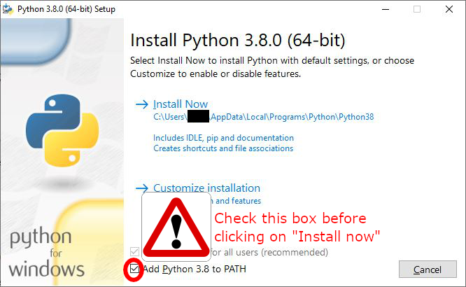
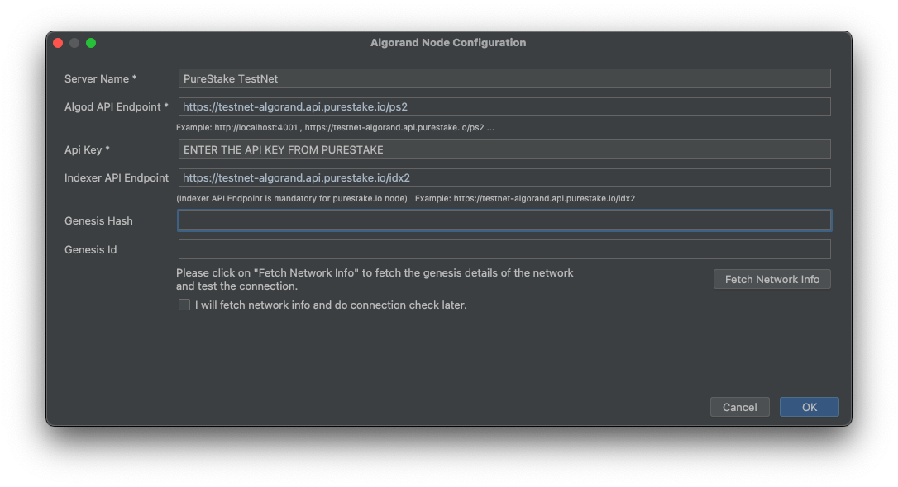
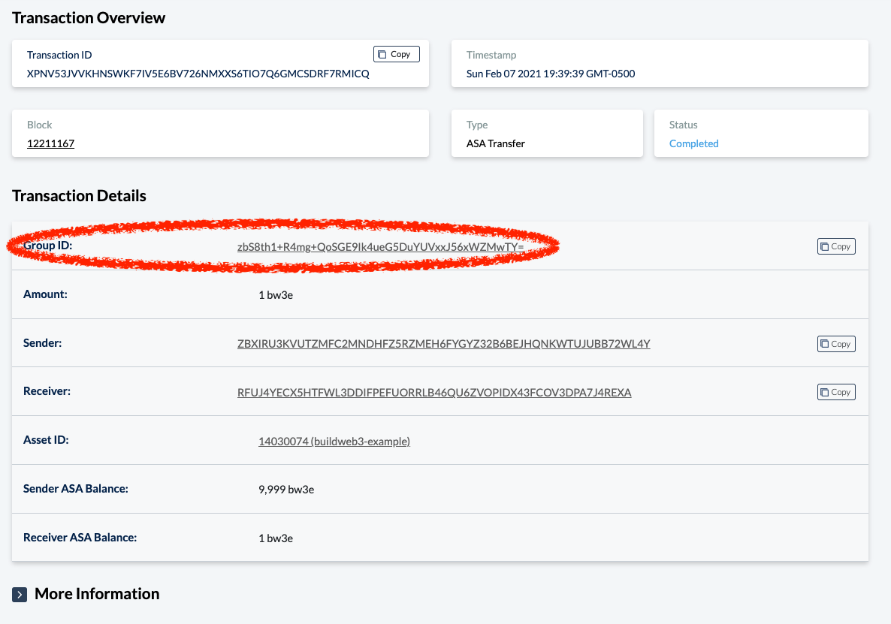
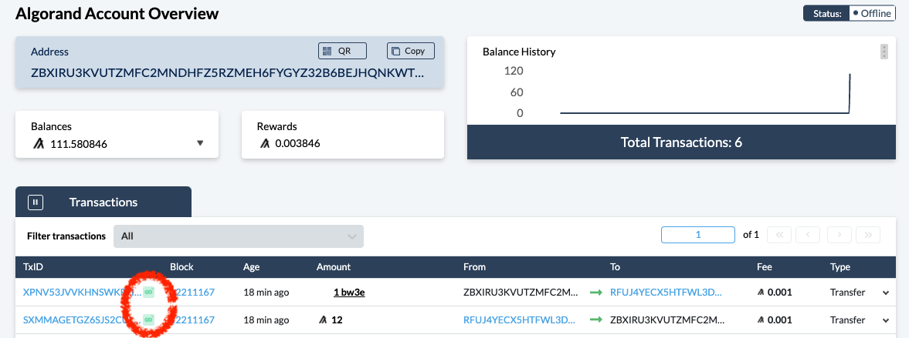

# Practical Homework 1 - Setup and Introduction to the Algorand Blockchain 

This is the homework for the Algorand class of "Building with Blockchain for Web 3.0" (https://buildweb3.org). The homework has been modified with permission to fit the needs of CIS 233 (Introduction to Blockchain) at the University of Pennsylvania.

## Why do this homework?
Throughout this course, many of the practical programming homeworks will be done by interacting with some blockchain infrastructure. There are many available blockchain technologies that we can build our homeworks on. We have decided to go with the Algorand blockchain. This homework will provide some basic stepping stones to set up your developer environment and get you acquainted with interacting with the Algorand blockchain.

## Background Concepts

A few key concepts to keep in mind throughout this homework.

The first is that “the blockchain” that you will be interacting with can be thought of as an instantiation of some protocol, in this case the Algorand protocol. This protocol defines a network of nodes (Algorand nodes), which at a very basic level are computers all around the world that are running the Algorand software, which implements the Algorand protocol. 

There are multiple instances of this network. The two largest instances are called the MainNet and the TestNet. These are both public networks (as in anyone can access and interact with them), but the MainNet uses a fixed supply of the native currency Algo, which has real monetary value. The TestNet on the other hand is public but for sandboxing purposes and thus has a “fake” Algo currency that can be generated out of thin-air (instead of purchasing them with real money). We will interact with the TestNet and not the MainNet in this homework.

Further, you can create your own private instantiations of the Algorand network. In the extreme case, this network may consist of just one node such as your laptop.

## Overview

In this homework, you will learn:

1. how to create your first Algorand accounts.
2. how to create and distribute your first asset or token on the Algorand blockchain.
3. how to trade your token "atomically" without any third party.
4. how to get the official "buildweb3" asset for just 4.2 Algos, by using your first smart signature (aka stateless smart contract).

*Warning*: All the homework is meant to be done on TestNet, where coins (called the Algos) are fake. When switching to MainNet, accounts store real cryptocurrency and proper security of key storage and management needs to be taken into consideration. We will never ask you to work on MainNet.

Note that we expect you to learn how to read through some open source documentation to complete this homework. If this is new to you, this will be a very useful skill in working with any open source projects (including blockchain projects) in the future.

Further, we expect you to be comfortable with some level of python. In this homework, you won't have to write your own code, just copy-pasting code-snippets you find on guides. However, in future homeworks, you will have to do your own programming. If your lack of python knowledge is inhibiting you, feel free to lookup very basic online tutorials (there are great ones on YouTube) or come to Office Hours.

## Step 0 - Setup

### Background

Algorand officially supports 4 Software Development Kits (SDK) for developing applications: Python, Javascript, Java, and Go. Additionally, Algorand has community SDKs for Rust and C#. You can think of the SDKs as language specific libraries that let you interact with the Algorand blockchain. In this course (and in the guide) we will use the Python SDK. 

To access a blockchain, you also need access to some node on the blockchain network. We be using the [free PureStake API Service](https://www.purestake.com/technology/algorand-api/) to do this.

### Step 0.1 - Install Python 3.8 and Pip

*Warning*: Python 2 will not work.

Python 3.8.0 (or later) with Pip must be installed on your computer. 

* On Windows 7/8/10: (warning: Windows XP is not supported)
    1. Download the Python installer on https://www.python.org/downloads/windows/
    2. In the first screen of the installer, make sure to select the checkboxes "Install launcher for all users" and "Add Python 3.8 to PATH".
    
* On macOS:
    * If you do not have [HomeBrew](https://brew.sh) installed, open a terminal and run:
    ```bash
    curl https://bootstrap.pypa.io/get-pip.py -o get-pip.py
    python3 get-pip.py
    ```
    * If you do use [HomeBrew](https://brew.sh), open a terminal and run:
    ```bash
    brew install python3
    ```
* On Ubuntu 18.04 or later, open a terminal and run:
    ```
    sudo apt update
	sudo apt install python3-pip
    ```

### Step 0.2 - Install the Python SDK

Open a terminal and run:

```bash
python3 -m pip install py-algorand-sdk --upgrade
```

Troubleshooting:
* If you are using Windows and get an error, replace `python3` by `python` everywhere.
* If you still get an error, check that you added python in the PATH when installing it (see above). If not, uninstall and re-install Python.

### Step 0.3 - Get a PureStake API Key

Visit https://developer.purestake.io/ to sign up for free and get a PureStake API Key to access the PureStake API service.

*Note*: Do not publish anywhere your PureStake API. Anytime you post publicly your code, remove your API key from the code.

### Step 0.4 - Install an IDE / an Editor

You will also need a code editor, such as [Visual Studio Code](https://code.visualstudio.com) or [PyCharm](https://www.jetbrains.com/pycharm/). If you already have an editor of choice, you may skip this. Otherwise, download and install one of the above editors.

(Optional) We recommend using PyCharm with the [AlgoDEA extension](https://algodea-docs.bloxbean.com/).
After installing the AlgoDEA extension in PyCharm:

1. Open PyCharm
2. Create a new Algorand project (instead of "Pure Python" project which is the default)
3. Set up the node by clicking on the "Algorand Explorer" on the top right and then fill in the information as shown below:
    
4. Click on the button "Fetch Network Info". "Genesis Hash" and "Genesis ID" should be automatically populated

Troubleshooting: If you don't see the "Algorand Explorer" tab, check you created a new Algorand project and not a Pure Python project.

## Step 1 - Create Two Algorand Accounts and Fund Them

### Background

In order to send transactions on the Algorand blockchain, you need to create an account.
Basic accounts on Algorand are defined by an *address* (or public key) and a *private key*.

The address is completely public and should be given to anybody who needs to send Algos or other assets/tokens to you, for example.

The *private key* is used to authorize transactions from your account by *signing* them. 
The private key is usually represented by a 25-word mnemonic. It should be kept secret.

### Step 1.1 - Create Two Algorand Accounts

**Task:** Create two Algorand accounts and report the two addresses in [form.md](form.md). The accounts will be called account A and B from now on.
Also, save the 25-mnemonic words of each account somewhere. You will need them later.

The Python SDK allows you easily to create wallets/accounts by running the following code:
```py
import algosdk

# Generate a fresh private key and associated account address
private_key, account_address = algosdk.account.generate_account()

# Convert the private key into a mnemonic which is easier to use
mnemonic = algosdk.mnemonic.from_private_key(private_key)

print("Private key mnemonic: " + mnemonic)
print("Account address: " + account_address)
```
The script will output the private key mnemonic and the account address, for example:
```plain
Private key mnemonic: six citizen candy robot jacket regular install tell end oven piece problem venture sleep arrow decorate chalk casual patient flat start upset tent abandon bounce
Account address: ZBXIRU3KVUTZMFC2MNDHFZ5RZMEH6FYGYZ32B6BEJHQNKWTUJUBB72WL4Y
```

*Important:* Never use this private key mnemonic to hold real Algos (i.e., on MainNet). Only use it for "fake Algos" on TestNet.

These accounts are now created and ready to use on the TestNet!

### Step 1.1 - Fund the Two Accounts

**Task:** Add 10 Algos to each of the accounts. The Algo is the native cryptocurrency of the Algorand blockchain.

In order to use your accounts, you need to add Algos to them. On MainNet, you would need to buy them for example on an exchange.
However, on TestNet, you can just use the [dispenser](https://bank.testnet.algorand.network).

For each account, copy the address in the text field, click on/solve the CAPTCHA, and click on Submit.
Refresh the page between each dispention.

### Step 1.2 - Check the Balance of your Accounts

**Task:** Check that the two accounts now have at least 10 Algos.

To check the balance of an account, go to a block explorer (e.g., [AlgoExplorer](https://testnet.algoexplorer.io)), search for your address and look at the balance. Block explorers let you observe the current state of the blockchains, which should contain your new funded accounts on the TestNet!

Each account should now have 10 Algos.
If this is not the case, go back to Step 1.1.

Remark that it takes less than 5s for the funding transaction to be committed to the blockchain and the balance to be updated.
Even more importantly, once the transaction appears in the block explorer (i.e., is committed to a block), the transaction is final and cannot be reversed or cancelled.
This is a distinctive property of the Algorand blockchain: **immediate finality**.

## Step 2 - Send your First Transactions

**Task:** From accounts A and B, send 1.42 Algos to `4O6BRAPVLX5ID23AZWV33TICD35TI6JWOHXVLPGO4VRJATO6MZZQRKC7RI` with notes `my first Algorand transaction` and `my second Algorand transaction` respectively. Write down the corresponding transaction ID (aka, TxID) of the two transactions in [form.md](form.md).

Any transaction can include an arbitrary "note" of up to 1kB.
In other words, notes allow to store small amount of data on the blockchain.
For this homework, the notes need to be `my first Algorand transaction` and `my second Algorand transaction` respectively.

The Python SDK allows you to send transactions. See the [tutorial "Your First Transaction"](https://developer.algorand.org/docs/sdks/python/) starting at step "Connect your client". Create a python file and copy-paste the appropriate code snippets in to send the transactions.

A few hints as you complete this tutorial.

To use the PureStake API service, define `algod_client` as:
```py
algod_client = algod.AlgodClient(
    algod_token="",
    algod_address="https://testnet-algorand.api.purestake.io/ps2",
    headers={"X-API-Key": "YOUR PURESTAKE API KEY"}
)
```

You also need to replace the amount and the note by the correct value.
Note that the amount is specified in microAlgos: 1,000,000 microAlgo = 1 Algo.

Finally, the code snippets require your private key, as opposed to your private key mnemonic. To convert your mnemonic to your private key, you’ll have to:
```py
from algosdk import mnemonic
private_key = mnemonic.to_private_key("place your mnemonic here")
```

You can confirm the two transactions were committed to the blockchain on any block explorer, by searching for the account address and clicking on the relevant transaction.
Check that the amount, the receiver, and the note are correct.
See for example a screenshot using [AlgoExplorer](https://testnet.algoexplorer.io).

Do not forget to copy the transaction ID to [form.md](form.md) (you can use the copy button circled in green).

#### Transaction Fees

To send a transaction on Algorand, you need to pay a fee. The minimum fee is 0.001 Algo (i.e., 1,000 microAlgos). The required fee may increase in case of congestion. When this homework was written, this never happened.
See the [developer documentation](https://developer.algorand.org/docs/features/transactions/#fees) for details.

## Step 3 - Your Own Custom Token/Asset (ASA)

The Algorand protocol supports the creation of on-chain assets or tokens (essentially, custom coins) that benefit from the same security, compatibility, speed and ease of use as the Algo. The official name for assets on Algorand is *Algorand Standard Assets (ASA)*.
ASAs can be used to represent stablecoins, loyalty points, system credits, in-game points, and collectibles, to name just a few. For more details, see [the developer documentation](https://developer.algorand.org/docs/features/asa/).

### Step 3.1 - Create your Asset

**Task:** Create your own asset on Algorand from account A. The creator account must be account A. The total supply (number of tokens) should be at least 10. Choose your preferred asset name, unit name, number of decimals, and URL. Set the manager, reserve, freeze, and clawback addresses to the address of account A. Report the Asset ID and its name on [form.md](form.md).

You can create assets using the Python SDK. See the [developer documentation](https://developer.algorand.org/docs/features/asa/#creating-an-asset) or the tutorial [Working with ASA using Python](https://developer.algorand.org/tutorials/asa-python). Note that the tutorial may use multiple accounts. For your homework, you should only use account A as creator/sender, manager, reserve, freeze, and clawback addresses. Furthermore, if some functions are missing from the code snippets found in the documentation, you can find those functions by following the link “See complete code...“.

You can search for your asset in a block explorer by searching for the asset ID.

### Step 3.2 - Opt-in to the Asset with Account B

Before being able to receive an asset, an account must first opt in to the asset.

**Task:** Make account B opt in to the asset you created. Report the opt-in transaction ID on [form.md](form.md).

An asset opt-in is just an asset transaction of 0 asset from the account to itself and can be seen on any block explorer.

You can send the opt-in transaction using the Python SDK. See the [developer documentation](https://developer.algorand.org/docs/features/asa/#receiving-an-asset) or the tutorial [Working with ASA using Python](https://developer.algorand.org/tutorials/asa-python).

### Step 3.3 - Sending 1 Asset to Account B

Now that account B opted in the asset, you can send 1 asset unit from account A to account B.

**Task:** Send 1 asset unit from account A to account B. Report the transaction ID on [form.md](form.md)

Send the asset transfer transaction using the Python SDK. See the [developer documentation](https://developer.algorand.org/docs/features/asa/#transferring-an-asset) or the tutorial [Working with ASA using Python](https://developer.algorand.org/tutorials/asa-python).

#### Minimum Balance

Any Algorand account must keep a minimum balance of 0.1 Algo. This is to prevent malicious people to create too many accounts, which could make the size of the account table (stored by all the nodes of the blockchain) explodes.
For every asset an account opts in or creates, the minimum balance is increased by 0.1 Algo.

See the [developer documentation](https://developer.algorand.org/docs/features/asa/#assets-overview) for more details.

## Step 4 - Trade Assets via Atomic Transfer

In the previous steps, we have seen how to transfer Algos, create assets, and transfer assets.
In many situations however, we need to trade or exchange x asset for y Algos (or y other assets).
For example account A may sell its asset to account B instead of giving it away.
One solution is just to have account B first send some Algos to pay for the asset, and then account A to send the asset.
But then account B cannot be sure account A will not run with the money.

Atomic transfers completely solve this issue.
Atomic transfers allow to group two transactions (transfer of asset from A to B, and transfer of Algos from B to A) in such a way that:

* either both transactions are successful: A gets its Algos and B gets its asset;
* or both transactions fail: A keeps it asset and B keeps its Algos.

**Task:** Make an atomic transfer where account B sends 1.2 Algos to account A and account A send 1 asset to account B. Report the transaction ID of the first transaction of the atomic transfer on [form.md](form.md)

Follow the [tutorial on the developer documentation](https://developer.algorand.org/docs/features/atomic_transfers).
Concretely, your Python script needs to:

1. Create a payment transaction of 1.2 Algos from B to A (like in Step 2). Do not sign it yet.
2. Create an asset transfer of 1 asset from A to B (like in Step 3.3). Do not sign it yet.
3. Group the two transactions together. Note that this modifies the transactions to ensure that one cannot be committed without the other. See [the developer documentation](https://developer.algorand.org/docs/features/atomic_transfers/#group-transactions).
4. Sign the first transaction using the private key of account B (like in Step 2).
5. Sign the second transaction using the private key of account A (like in Step 3.3).
6. Send both transactions together. See [the developer documentation](https://developer.algorand.org/docs/features/atomic_transfers/#assemble-transaction-group).
7. Check on a block explorer that the group transaction was committed properly.

On [AlgoExplorer](https://testnet.algoexplorer.io) you can see that transactions are grouped in two ways:

1. Each transaction of the group has a group ID, which links to a page with all the transactions of the group. See screenshot below:

2. If multiple transactions in a group involves the same account, on the account page there is a small icon next to the transactions. See screenshot below:


If you do not see the above, it means you sent two independent transactions instead of making an atomic transfer.

## (Extra Credit) Step 5 - Automating Trading

While atomic transfers are very useful to trade assets, they require each account involved in the trade to sign the transactions.
In some cases, you may want to allow anybody to trade assets with you without having to sign transactions.
Smart signatures allow to make an account automatically approve transactions that follow some criteria.

To show the power of smart signatures, we created an exclusive asset for the class "buildweb3" and provided a smart signature that will allow you to receive 1 unit of the asset for just 4.2 Algos!
The smart signature approves transactions of 1 unit of the asset if it is in a group of 2 transactions (aka atomic transfer) where:
1. the first transaction sends 4.2 Algos to the smart signature account (this transaction is signed by your account),
2. the second transaction sends 1 unit of the asset "buildweb3" from the smart signature account (this transaction is approved by the smart signature rather than being signed).

### Step 5.1 - Opt-in to the Exclusive Asset "buildweb3"

**Task:** Make account A opt in to the asset "buildweb3" with ID 14035004. Report the opt-in transaction ID on [form.md](form.md).

Remember that opt-in transactions were covered in Step 3.3.

### Step 5.2 - Receive 1 "buildweb3" Asset

**Task:** Make an atomic transfer of 4.2 Algos from account A to `4O6BRAPVLX5ID23AZWV33TICD35TI6JWOHXVLPGO4VRJATO6MZZQRKC7RI` and of 1 "buildweb3" asset (ID 14035004) from `4O6BRAPVLX5ID23AZWV33TICD35TI6JWOHXVLPGO4VRJATO6MZZQRKC7RI` to account A, where the second transaction is signed using the [signed smart signature (aka delegated logic sig)](step5.lsig).

This task is similar to Step 4, except that the second transaction is signed using a delegated logic sig / smart signature instead of a normal signature.
Concretely, assume `txn2` is the second transaction of your atomic transfer
Instead of signing it with `stxn2 = txn2.sign(private_key)`, you do the following:
```py
with open("step5.lsig", "rb") as f:
    lsig = encoding.future_msgpack_decode(base64.b64encode(f.read()))
stxn2 = LogicSigTransaction(txn2, lsig)
```

The full script should look like:
```py
import base64

from algosdk import mnemonic, encoding
from algosdk.v2client import algod
from algosdk.future import transaction
from algosdk.future.transaction import LogicSigTransaction, PaymentTxn, AssetTransferTxn

# Setup algod_client and global variables
...

# Get the suggested parameters
params = algod_client.suggested_params()

# Create the two transactions
txn1 = PaymentTxn(...)
txn2 = AssetTransferTxn(...)

# Group the two transactions
...

# Sign both transactions
stxn1 = txn1.sign(...)
with open("step5.lsig", "rb") as f:
    lsig = encoding.future_msgpack_decode(base64.b64encode(f.read()))
stxn2 = LogicSigTransaction(txn2, lsig)

# Assemble the signed group
signed_group = [stxn1, stxn2]

# Send the signed group
txid = algod_client.send_transactions(signed_group)

# Print the transaction ID of the first transaction of the group
print("Send transaction with txID: {}".format(txid))

Remember to update [form.md](form.md) with the transaction ID of the first transaction of the atomic transfer.
```

### Going Further (helpful info for HW 2)

#### Contract Accounts vs Delegated Logic Sig

The smart signature in Step 5 is used as a delegated logic sig: it allows a normal account to delegate some abilities to anyone. 
Here the ability is to send 1 unit of asset in an atomic transfer where the first transaction pays 42 Algos.
Anybody knowing the private key of the underlying account can sign arbitrary transactions without any restriction.
A delegated logic sig is essentially a compiled smart signature signed by the private key of the underlying account.

Algorand also supports more classical smart signature contract accounts.
Smart signature contract accounts are accounts that are only controlled by a smart signature.
All transactions must be approved by the smart signature and there is no associated private key.

See [the developer documentation](https://developer.algorand.org/docs/get-details/dapps/smart-contracts/smartsigs/modes/) for details.

#### Explanation on How the Smart Signature Works

The actual smart signature is [step5.teal](step5.teal).
It was generated using [PyTeal](https://github.com/algorand/pyteal) that simplifies the writing of TEAL scripts, the language of smart contracts and smart signatures on Algorand.
In other words, [step5.teal](step5.teal) is the output of [step5.teal.py](step5.teal.py).

Concretely, to generate `step5.lsig`, the secret key of  `4O6BRAPVLX5ID23AZWV33TICD35TI6JWOHXVLPGO4VRJATO6MZZQRKC7RI` was added to `kmd` using `goal account import`, and then the following commands were run:
```bash
python3 step5.teal.py > step5.teal
goal clerk compile -a 4O6BRAPVLX5ID23AZWV33TICD35TI6JWOHXVLPGO4VRJATO6MZZQRKC7RI -s step5.teal -o step5.lsig
```
This assumes that PyTeal is installed via `python3 -m pip pyteal` and that the [Algorand Command Line Interface Tools](https://developer.algorand.org/docs/build-apps/setup/#command-line-interface-cli-tools) were installed.

#### Smart Contracts

The smart signatures described previously are used to approve or reject transactions.
They cannot store any variables / state on the blockchain.

Algorand also has smart contracts.
See [the developer documentation](https://developer.algorand.org/docs/get-details/dapps/smart-contracts/apps/) for details.
The developer websites contain several examples of stateful smart contracts on Algorand:
* [Voting dApp](https://developer.algorand.org/solutions/example-permissioned-voting-stateful-smart-contract-application/).
* [Crowdfunding smart contract](https://developer.algorand.org/solutions/example-crowdfunding-stateful-smart-contract-application/) and its [associated frontend](https://developer.algorand.org/solutions/creating-crowdfunding-application-algorand-blockchain/).

Most dApps actually now use smart contracts rather than smart signatures.
Still smart signatures are useful in some specific use cases like the above simple automated trading (a smart contract would have been slightly more complex) and when very complex operations need to be performed (like slow cryptographic operations).

## Submission
Submit your form.md file and the python files you used to interact with the blockchain on gradescope.

This concludes the homework! 🎉🎉
